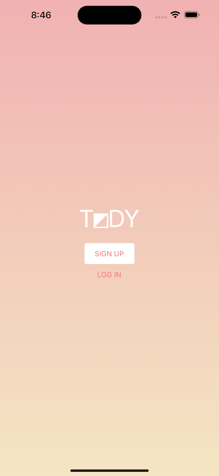
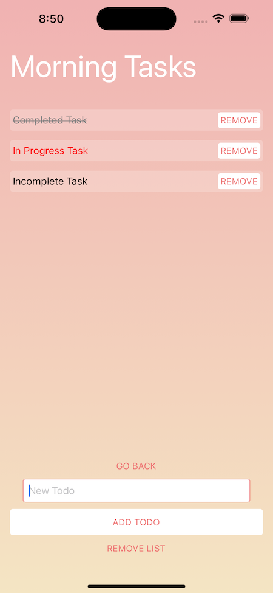

# T◩DY
This is, currently, and MVP built over a couple days for a todo app that works like I do with tasks in one of three states: incomplete, partially complete, or complete.

This uses the following things:
- [React Native](https://reactnative.dev/)
- [React](https://react.dev/)
- [Redux](https://redux.js.org/)
- [Supabase](https://supabase.com/)
- [TypeScript](https://www.typescriptlang.org/)
- [Jest](https://jestjs.io/)
- [Expo](https://expo.dev/)
- Basic Authenticaion with Username and Password

What I've yet to add:
- Propper testing coverage. Having issues getting jest and the react-native
testing library to place nice.
- Lots of features that help to keep you produtive.
- Time-based compeltion.
- Lots before it's ready for showtime, but hit me up at [jomurgel.com](https://jomurgel.com) if you're interested in helping out.

## Usage
`npm ci && npm run ios` or `npm ci && npm run android` with Simulator or Android
Studio running respectively.

## Screens

